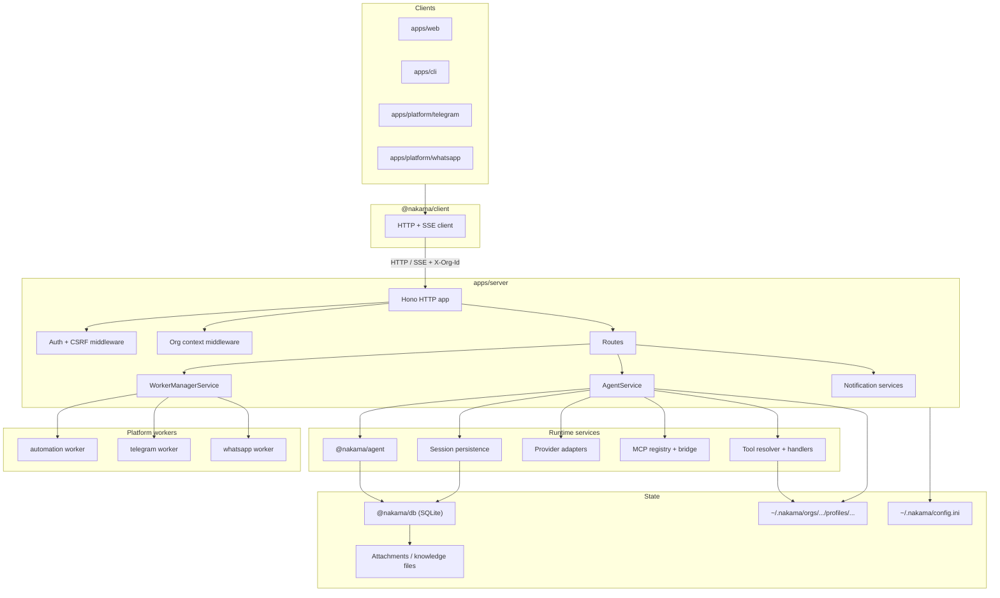

# Nakama Architecture

Nakama is a multi-tenant AI agent platform with one shared server runtime and several thin clients. Each **organization** is the tenant boundary. Profiles, sessions, tools, MCP servers, skills, automations, tasks, attachments, and usage data are all scoped to an org unless explicitly platform-level.

## System overview



**Dependency rule:** `packages/*` can be imported by `apps/*`, but not the other way around.

## Repo map

```text
nakama/
├── apps/
│   ├── server/              # HTTP API, auth, org middleware, agent orchestration
│   ├── web/                 # Dashboard
│   ├── cli/                 # Terminal client
│   └── platform/
│       ├── automation/      # Scheduler / automation worker
│       ├── telegram/        # Telegram bridge
│       └── whatsapp/        # WhatsApp bridge
├── packages/
│   ├── agent/               # Prompt assembly, tool loop, chat session runtime
│   ├── core/                # Contracts, soul system, config, builtin tool defs
│   ├── db/                  # SQLite schema, adapters, migrations
│   └── client/              # Shared HTTP/SSE client
└── docs/website/            # Documentation site
```

## Main boundaries

**Clients are thin.** `apps/web`, `apps/cli`, Telegram, and WhatsApp talk to `apps/server` through HTTP/SSE. They do not run the agent loop themselves.

**Server owns orchestration.** `apps/server/src/services/agent-service.ts` is the main composition layer. It wires profiles, providers, tools, MCP servers, soul files, attachments, questionnaire/todo state, and persistence around `@nakama/agent`.

**Agent package is runtime logic.** `packages/agent` builds prompts, runs the tool loop, manages compaction, and exposes `AgentChatSession`.

**Core package is shared contract/config logic.** `packages/core` holds request/response types, soul composition, built-in tool definitions, channel helpers, attachment helpers, and config readers.

**DB package owns persistence.** `packages/db` defines schema and adapters for orgs, users, memberships, profiles, sessions, messages, automations, tasks, notifications, MCP servers, skills, attachments, and usage stats.

## HTTP architecture

The server entrypoint is [`apps/server/src/http/app.ts`](./nakama/apps/server/src/http/app.ts). Request flow is:

1. Static web assets are served first when `webDistDir` is present.
2. Auth middleware validates bearer auth or browser session auth and applies CSRF checks where needed.
3. Internal automation and notification webhook routes are registered before org middleware.
4. Org middleware resolves `X-Org-Id` or browser `active_org_id`, verifies membership, and attaches `orgRole`.
5. Route modules under `apps/server/src/http/routes/*` call services.
6. `/openapi.json` is generated from the same Hono route registration used at runtime.

Current route groups include:

- `auth`
- `sessions`
- `profiles`
- `tools`
- `skills`
- `mcp`
- `automations`
- `tasks`
- `notification-destinations`
- `notification-webhooks`
- `workers`
- `platform-orgs`
- `org-members`
- `data-portability`
- `system`
- `models`
- `user-context`

## Multi-tenancy and auth

Organizations are the tenant boundary. Every authenticated non-platform request must resolve an active org.

- Header-based org selection: `X-Org-Id`
- Browser session fallback: `active_org_id`
- Org roles: `admin`, `member`, `viewer`
- Platform admin routes stay under `/v1/platform/*`

Important files:

- [`apps/server/src/http/org-middleware.ts`](./nakama/apps/server/src/http/org-middleware.ts)
- [`apps/server/src/http/org-guards.ts`](./nakama/apps/server/src/http/org-guards.ts)
- [`apps/server/src/services/org-service.ts`](./nakama/apps/server/src/services/org-service.ts)

## Agent runtime

The runtime is assembled in [`apps/server/src/services/agent-service.ts`](./nakama/apps/server/src/services/agent-service.ts).

Per session, the server resolves:

- profile + soul files
- provider/model selection
- built-in tools
- assigned custom JS tools
- assigned MCP tools
- Super Bot runtime-only tools
- questionnaire/todo state
- attachment save/load helpers

Prompt construction happens in three layers:

1. [`packages/core/src/soul/compose.ts`](./nakama/packages/core/src/soul/compose.ts) for soul content
2. [`packages/agent/src/chat-prompt.ts`](./nakama/packages/agent/src/chat-prompt.ts) for chat structure and tool instructions
3. [`packages/agent/src/chat.ts`](./nakama/packages/agent/src/chat.ts) for final per-turn generation

## Sessions and persistence

This was one of the main places the old doc drifted.

- `AgentChatSession` still manages live conversation state in memory while a session is active.
- Session history is also persisted to SQLite in `session_messages`.
- `apps/server/src/services/session-persistence.ts` wraps sessions so sends, streaming replies, and compaction update durable history.
- Session metadata also stores questionnaire and todo state on the `sessions` table.

Relevant tables:

- `sessions`
- `session_messages`
- `attachments`

## Tools and MCP

Built-in tool definitions live in `packages/core/src/tools/*`.

Execution paths are split:

- built-in shared tools: `packages/core/src/tools/*`
- server-side runtime tools: `apps/server/src/tools/*`
- custom JavaScript tools: loaded by `apps/server/src/services/javascript-tool-loader.ts`
- MCP-backed tools: expanded through `apps/server/src/services/mcp-tool-bridge.ts`

Tool access is profile-scoped. The model only receives tools assigned to the active profile, plus extra runtime tools for Super Bot when allowed.

## Workers, automations, and tasks

Nakama now has a clearer worker/runtime split than the older doc suggested.

- `apps/platform/automation` runs scheduled automation work
- `apps/platform/telegram` handles Telegram delivery/inbound flow
- `apps/platform/whatsapp` handles WhatsApp delivery/inbound flow
- `apps/server/src/services/worker-manager-service.ts` manages them through PM2

Automations and tasks are separate persisted concepts:

- `automations` + `automation_runs`
- `tasks` + `task_runs`

Core services:

- [`apps/server/src/services/automation-service.ts`](./nakama/apps/server/src/services/automation-service.ts)
- [`apps/server/src/services/automation-runner.ts`](./nakama/apps/server/src/services/automation-runner.ts)
- [`apps/server/src/services/task-service.ts`](./nakama/apps/server/src/services/task-service.ts)
- [`apps/server/src/services/task-runner.ts`](./nakama/apps/server/src/services/task-runner.ts)

## Notifications and attachments

Two newer areas that deserve explicit mention:

- Notification destinations and incoming webhooks are first-class server features.
- Attachments are stored as records in SQLite and files on disk, then rehydrated into model/provider message format when needed.

Key files:

- [`apps/server/src/services/notification-destination-service.ts`](./nakama/apps/server/src/services/notification-destination-service.ts)
- [`apps/server/src/services/notification-webhook-service.ts`](./nakama/apps/server/src/services/notification-webhook-service.ts)
- [`apps/server/src/services/attachment-service.ts`](./nakama/apps/server/src/services/attachment-service.ts)

## CLI terminal rendering

The CLI uses a small terminal UI pipeline instead of printing lines directly.

### Main files

- [`apps/cli/src/terminal-renderer.ts`](./nakama/apps/cli/src/terminal-renderer.ts): semantic layer for composer state, transcript events, streaming state, and status lines
- [`apps/cli/src/terminal-layout.ts`](./nakama/apps/cli/src/terminal-layout.ts): viewport math, pinned input area, stream buffer, frame diffing, and terminal writes
- [`apps/cli/src/virtual-message-list.ts`](./nakama/apps/cli/src/virtual-message-list.ts): transcript storage plus lazy wrapping and message spacing rules
- [`apps/cli/src/terminal-frame.ts`](./nakama/apps/cli/src/terminal-frame.ts): frame diff and cursor placement

### Terms

- `composer`: the live prompt UI at the bottom, including the gray padded box, current input, pending queue, and suggestions
- `reserved rows`: terminal rows permanently held for the composer so output does not overwrite it
- `transcript`: sealed message history already committed into `VirtualMessageList`
- `open message`: a message started with `beginMessage()` but not yet sealed with `endMessage()`
- `stream buffer`: temporary assistant text while streaming is still in progress
- `status line`: ephemeral line such as thinking/loading state, rendered between transcript content and the composer
- `viewport`: the visible terminal region managed by the diff renderer
- `pinned input`: the behavior where the composer stays attached to the bottom of the viewport while history scrolls above it

### Flow

1. `PersistentPrompt` updates composer state.
2. `TerminalRenderer` converts that state into display lines with `buildComposerLines()`.
3. `TerminalLayout` reserves rows for those lines and renders the current frame.
4. Submitted messages and tool/output events are appended as transcript messages through `beginMessage()`, `writelnScroll()`, and `endMessage()`.
5. Assistant streaming writes into `streamBuffer` first, then `endStream()` flushes it into the transcript as a sealed assistant message.

### Spacing rules

- Submitted user messages intentionally render as a padded "bubble" with one blank surface row above and below the text.
- Composer input also keeps blank surface rows above and below the current input line for the same visual treatment.
- Conversational blocks (`user`, `assistant`, `tool`) get a leading blank separator before the block when they are not the first message.
- Output-only lines stay compact and do not automatically get conversational separators.
- When an assistant stream becomes a sealed transcript message, `TerminalLayout.endStream()` inserts one extra wrapped blank row above that sealed assistant reply. This is separate from the normal conversational separator.

### Where confusion usually comes from

The CLI has multiple independent sources of "space":

- user bubble padding in `VirtualMessageList`
- composer padding in `buildComposerLines()`
- inter-message separators in `shouldInsertLeadingGap()`
- post-stream assistant spacing in `TerminalLayout.endStream()`

When adjusting terminal spacing, treat these as separate layers. A visual gap in the CLI is often caused by one of these rules, not all of them.

## Persistence model

The main SQLite schema lives in [`packages/db/sql/schema.sql`](./nakama/packages/db/sql/schema.sql).

High-value tables today:

- tenant + auth: `organizations`, `users`, `org_members`, `org_invites`, `browser_sessions`
- agent config: `profiles`, `tools`, `profile_tools`, `skills`, `profile_skills`, `mcp_servers`, `profile_mcp_servers`
- runtime state: `sessions`, `session_messages`, `attachments`
- execution: `automations`, `automation_runs`, `tasks`, `task_runs`
- notifications: `notification_destinations`
- analytics/config: `llm_usage_stats`, `llm_usage_model_stats`, `workspace_settings`

## Current invariants

- `packages/*` must not import from `apps/*`
- Org membership is checked before org-scoped routes run
- Profiles control agent behavior and tool availability
- Message history is durable, not purely process-memory anymore
- OpenAPI is generated from the same Hono app used at runtime
- Channel apps are transport bridges, not separate agent implementations
- PM2 worker management is optional at runtime but is the intended orchestration path for platform workers
