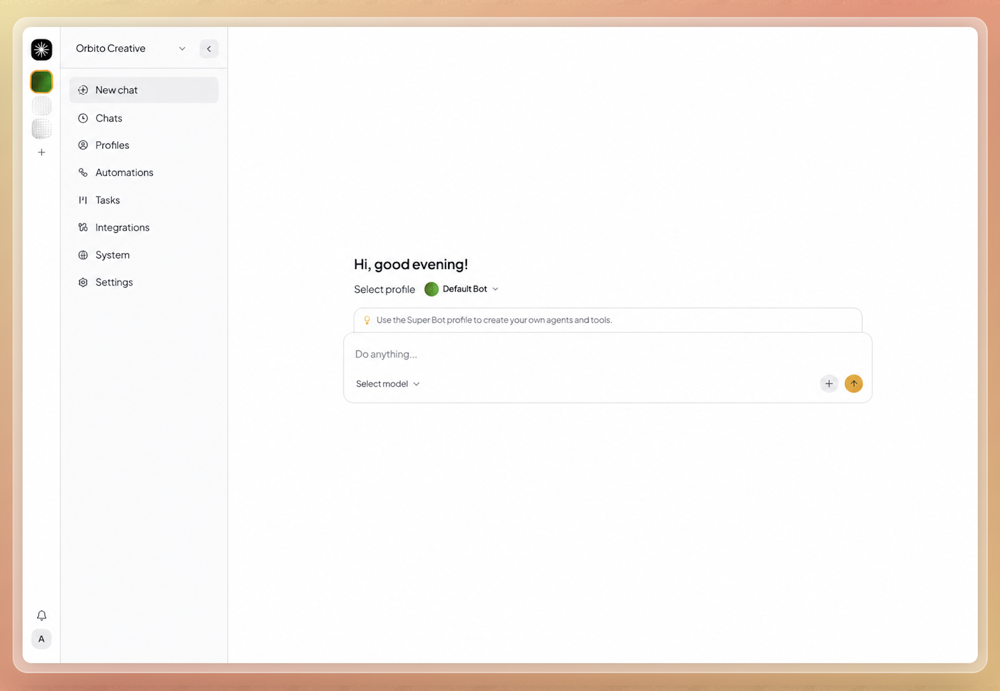

<p align="center">
  <picture>
    <source media="(prefers-color-scheme: dark)" srcset="assets/nakama-logo-dither-dark.png" />
    
  </picture>
</p>

<p align="center">
  <a href="https://discord.gg/qhKbMFEUc"></a>
</p>

# Nakama

> Deploy your own AI Agent platform as easily as spinning up WordPress.

[Documentation](https://ahmadrosid.github.io/nakama/) · [Demo](https://demo.getnakama.cloud) · [Managed hosting](https://getnakama.cloud/)

Nakama is a small, self-hosted Bun + TypeScript monorepo for running AI agents. Inspired by [OpenClaw](https://github.com/openclaw/openclaw) and [Hermes Agent](https://github.com/nousresearch/hermes-agent) — same self-hosted agent idea (tools, channels, soul, automations) — but **multi-tenant by design**. Those projects target one operator on one machine; Nakama is one server, many orgs, with isolated profiles, sessions, member invites, and roles built in.

<picture>
  <source media="(prefers-color-scheme: dark)" srcset="assets/nakama_demo_dark.png" />
  
</picture>

See [ARCHITECTURE.md](./ARCHITECTURE.md) for system design, or the [docs site](https://ahmadrosid.github.io/nakama/) for the full guide.

## Quick start

### Try the demo

Open the live demo at [https://demo.getnakama.cloud](https://demo.getnakama.cloud).

- Username: `demo@getnakama.cloud`
- Password: `demo1234`

### Managed hosting

The fastest way to try Nakama is [Nakama Cloud](https://getnakama.cloud/). Create an account, provision an instance, complete the first-time setup wizard in the browser, and you are live — no Bun, Docker, or VPS required.

### Run locally

Requires [Bun](https://bun.sh).

```bash
# Install dependencies
bun install

# Start the web (starts the server automatically if needed)
bun run dev:web
```

Visit web dashboard: http://localhost:3000

Or run the server on its own:

```bash
bun run dev:server
```

### Docker

You can also run Nakama with Docker.

**Prebuilt image (quickest):**

```bash
# Pull and run the latest image
docker pull ghcr.io/ahmadrosid/nakama:latest
docker run -d -p 4310:4310 -v nakama-data:/nakama/data --name nakama ghcr.io/ahmadrosid/nakama:latest
```

**Build from source:**

```bash
./scripts/docker-build-run.sh
```

**Fresh start:**

```bash
./scripts/docker-destroy.sh
./scripts/docker-build-run.sh
```

The dashboard will be available at http://localhost:4310.

### Integrations

Nakama integrates with **Telegram**, **WhatsApp**, and **Composio** (SaaS app connections). Enable them in the web app under **Integrations**.

For Composio, save your API key under **Integrations → Composio** (stored in `~/.nakama/composio/config.ini`). Org admins connect OAuth apps on Integrations; assign toolkits per profile on **Profiles**.

On first run, the server prompts for a provider and API key if none is configured. Settings are saved to `~/.nakama/config.ini`.

The server listens on `http://127.0.0.1:4310` by default. Interactive API docs are available at `http://127.0.0.1:4310/docs`.

## License

MIT
