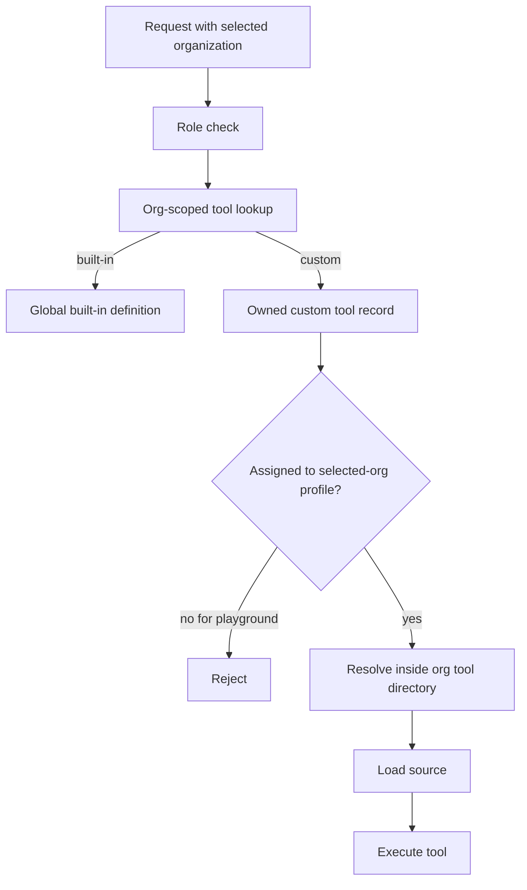

# Tenant-scope custom tools

## Goal Capsule

- **Objective:** One organization cannot see, change, or run another organization’s custom tools.
- **Means:** Give every custom tool an owning organization, store its files under that organization, and require ownership plus profile assignment at every access point.
- **Authority:** Issue #1091 and the user’s decisions in this planning session define the behavior; existing tenant and platform-admin patterns define the implementation shape.
- **Stop conditions:** Do not change built-in tool behavior, and do not broaden this work into the already-closed unsafe-execution issues.
- **Execution profile:** Security-sensitive migration with regression tests before handoff.

## Product Contract

### Summary

Custom tools are currently partly global even though the product is multi-organization. This can expose source code, allow cross-organization execution, and let one organization replace code used by another.

The fix makes custom tools organization-owned from storage through execution. Existing tools and files are moved automatically to the organization that already uses them. Platform admins may work across organizations, but each request still acts on the selected organization.

### Problem Frame

The organization boundary is not enforced consistently. A tool ID or shared file path can bypass the active organization, which is especially dangerous because custom tools execute server-side code.

### Requirements

- R1. Every custom tool has an owning organization. Built-in tools remain globally available.
- R2. Custom tool source files live under the owning organization’s tool directory.
- R3. Tool detail, source, update, delete, assignment, and execution requests must resolve custom tools within the selected organization.
- R4. A custom tool can run in the playground only when it is assigned to a profile in the selected organization. There is no unrelated default-profile fallback.
- R5. File-write permissions and loader validation must reject the old install-global custom-tool directory and paths outside the owning organization’s directory.
- R6. Existing database records and shared custom-tool files are migrated automatically to their owning organization without silently making them visible to every organization.
- R7. Platform admins retain multi-organization access, but the selected organization remains the scope for the current request and displayed data.
- R8. Built-in tools keep their current global behavior.

### Acceptance Examples

- An admin in Organization B cannot read, list, update, delete, assign, or run a custom tool owned by Organization A, even when they know its ID.
- An admin in Organization A can still use an existing custom tool after the migration, with its source now under Organization A’s directory.
- A tool assigned only to Organization A’s profile cannot run from Organization B’s playground.
- A playground request for an unassigned tool fails instead of using the selected organization’s default or first profile.
- An agent cannot write into the legacy shared tool directory or another organization’s tool directory.
- A platform admin can switch the selected organization and work there, but cannot accidentally read data from a different organization in the same request.
- Built-in tools remain visible and usable under the existing authorization model.

### Scope Boundaries

#### Deferred for later

- Redesigning custom-tool sandboxing or server privilege levels.
- Changing the behavior covered by closed issues #447 and #481.
- Adding a new UI for managing tool ownership beyond the existing selected-organization flow.

#### Outside this work

- Non-tool tenant data that is not part of the custom-tool source, lookup, assignment, or execution path.

## Planning Contract

### Key Technical Decisions

- KTD1. **Use the existing organization ID on tool records as the ownership field.** The repository already has migration helpers and org-aware filtering patterns; avoid introducing a second ownership model.
- KTD2. **Move legacy tools based on their existing profile assignments.** A tool used by profiles in one organization is assigned to that organization during migration; ambiguous or unused legacy tools must be quarantined or handled by an explicit migration rule rather than exposed globally. (session-settled: user-directed — chosen over manual recreation: existing tools should continue working after upgrade.)
- KTD3. **Keep platform-admin authority broad but request scope narrow.** Platform admins may access multiple organizations by switching the selected organization, while service methods still receive and enforce the selected organization for ordinary reads and mutations. (session-settled: user-directed — chosen over unrestricted global reads: the current organization view must remain trustworthy.)
- KTD4. **Move files, then store organization-relative paths.** The loader receives organization context and resolves only inside that organization’s tool root; absolute paths and traversal are rejected.
- KTD5. **Use the existing profile assignment as the playground authorization check.** Remove the default/first-profile fallback instead of adding a separate playground permission model.

### High-Level Technical Design

Migration must handle both records and files. First determine the owning organization from current profile assignments, move the source file into that organization’s tool directory, update the stored relative path, and only then enable the new org-scoped lookup rules. The migration must be rerunnable and must fail safely when ownership is ambiguous.

The migration invariant is simple: every custom tool has one owner, every assigned profile belongs to that owner, and its module path resolves inside that owner’s directory. If a file move succeeds but the database update fails, the next startup must be able to detect and finish the move; if ownership cannot be inferred, the tool must remain unavailable rather than become global. Keep the database changes transactional and make filesystem moves deterministic and repeatable.

### Assumptions

- A legacy custom tool can be assigned to profiles belonging to one organization, which is enough to infer ownership for normal existing installations.
- Tools with no profile assignment or assignments spanning organizations need an explicit safe outcome in the migration rather than a guessed owner.
- The existing `migrateTenantOrgScope` path is the migration entry point; no separate migration framework is needed.
- Current branch code already contains partial `orgId` support, so implementation must reconcile schema, types, adapters, services, and tests instead of assuming a blank slate.

### System-Wide Impact

- Database reads and writes for tools become organization-aware.
- Custom JavaScript and Python loaders receive organization context and use an organization-specific root.
- `write_file` loses access to the install-global custom-tool directory.
- Profile portability/export-import must keep custom-tool files scoped to the destination organization.
- Platform-admin requests continue to work, but selected-organization context must be passed through rather than bypassed.

### Risks & Dependencies

- **Legacy ownership ambiguity:** An unused or multi-organization tool cannot be safely assigned by guessing. The migration needs a quarantine or explicit operator-visible failure path.
- **Path compatibility:** Existing `modulePath` values are relative to the old shared directory. The migration must rewrite them to the new org-relative location and reject absolute or escaping paths.
- **Partial migration:** Database and filesystem changes can get out of sync. Use the existing database transaction conventions and make file moves recoverable or repeatable.
- **Rollback and recovery:** A failed move must leave enough information to retry safely without overwriting a different organization’s file. Preserve the old file until the new copy and database update are confirmed, then remove the old copy.
- **Authorization gaps:** Fixing only the HTTP route is insufficient because service and database callers can still bypass it. The org check belongs in shared service lookup paths.

### Sources & Research

- Issue #1091: https://github.com/ahmadrosid/nakama/issues/1091
- Existing tenant migration and tool schema work: `packages/db/src/migrate.ts`, `packages/db/src/adapters/sqlite.ts`, `packages/db/src/types.ts`.
- Existing tool authorization and playground paths: `apps/server/src/http/routes/tools.ts`, `apps/server/src/services/profile-service.ts`, `apps/server/src/services/agent-service.ts`.
- Existing custom-tool path validation: `apps/server/src/services/custom-tool-shared.ts`.
- Existing profile-pack custom-tool handling: `apps/server/src/services/profile-portability.ts`.
- SQLite supports adding columns directly, but constraints on existing rows and the limited `ALTER TABLE` surface require the migration to follow the repository’s existing helper pattern: [SQLite ALTER TABLE](https://www.sqlite.org/lang_altertable.html).
- The path boundary should continue using canonical paths and relative-path checks: [Node.js path.relative](https://nodejs.org/api/path.html#pathrelativefrom-to).

## Implementation Units

### U1. Make tool ownership complete in the database

- **Goal:** Ensure custom tool records, queries, assignments, and mutations distinguish organization-owned custom tools from global built-ins.
- **Requirements:** R1, R3, R8.
- **Files:** `packages/db/sql/schema.sql`, `packages/db/src/migrate.ts`, `packages/db/src/adapters/sqlite.ts`, `packages/db/src/types.ts`, related database tests.
- **Approach:** Align the schema and adapter types with the existing migration-added `org_id`; add org-scoped get/list/update/delete helpers or equivalent service-facing queries; preserve global built-in rows; enforce organization-aware uniqueness and assignment checks.
- **Test scenarios:**
  - A custom tool created for Organization A is absent from Organization B’s org-scoped lookup.
  - A built-in tool remains available to both organizations.
  - Updating or deleting with the wrong organization cannot affect the record.
  - A profile cannot receive a custom tool owned by another organization.
  - Existing database rows migrate without losing tool metadata.
- **Verification:** Database migration tests plus focused adapter/service tests.
- **Dependencies:** None.

### U2. Migrate custom-tool records and files into organization folders

- **Goal:** Move existing shared custom-tool files and rewrite their stored paths safely.
- **Requirements:** R2, R6.
- **Files:** `packages/db/src/migrate.ts`, `apps/server/src/services/custom-tool-shared.ts`, `apps/server/src/services/custom-tool-test-helpers.ts`, migration tests, relevant filesystem tests.
- **Approach:** Infer ownership from profile assignments; move files from the legacy shared directory to an organization-scoped directory; rewrite relative paths; make the operation repeatable; quarantine or stop safely on unused or cross-organization records; never leave a custom tool globally readable as a fallback.
- **Test scenarios:**
  - A legacy tool assigned to one organization is moved and still loads from its new path.
  - A tool with no assignment follows the documented safe migration outcome and is not globally exposed.
  - A tool assigned across organizations is not silently given to one tenant.
  - Re-running migration does not duplicate files or corrupt paths.
  - Missing legacy files produce a safe error state without creating an escaping path.
- **Verification:** Migration tests using temporary config directories and checks for both database paths and filesystem contents.
- **Dependencies:** U1.

### U3. Resolve and validate custom modules only inside the owning organization

- **Goal:** Close file-write, loader, and subprocess path escapes.
- **Requirements:** R2, R5.
- **Files:** `packages/core/src/tools/builtin.ts`, `packages/core/src/tools/paths.ts`, `apps/server/src/services/custom-tool-shared.ts`, `apps/server/src/services/javascript-tool-loader.ts`, `apps/server/src/services/python-tool-loader.ts`, and their focused tests.
- **Approach:** Replace the shared custom-tool root with an org-aware root; pass organization identity through loader resolution; allow only organization-relative module paths; keep the existing canonical-path boundary check; remove the legacy global root from `write_file` allowlisted directories.
- **Test scenarios:**
  - A valid relative module path loads for its owner organization.
  - `../`, absolute, symlinked, and cross-organization paths are rejected.
  - JavaScript and Python loaders resolve to the same organization root.
  - `write_file` can write profile files but cannot write legacy or other-organization tool files.
  - Built-in tools do not require a custom module path.
- **Verification:** Focused loader and built-in tool tests for both accepted and rejected paths.
- **Dependencies:** U2.

### U4. Enforce selected-organization access across services and routes

- **Goal:** Make every custom-tool detail, source, mutation, assignment, and execution path honor the selected organization while preserving platform-admin multi-org access.
- **Requirements:** R3, R7.
- **Files:** `apps/server/src/http/routes/tools.ts`, `apps/server/src/services/profile-service.ts`, `apps/server/src/services/agent-service.ts`, `apps/server/src/services/tool-source.ts`, related contract/client types if signatures change.
- **Approach:** Thread `orgId` through shared service lookups; return the existing not-found behavior for tools outside the selected organization; keep platform-admin role checks but do not let them bypass selected-org scoping; ensure list, detail, source, delete, assign, and update paths use the same ownership rule.
- **Test scenarios:**
  - Organization B cannot fetch Organization A’s detail or source by ID.
  - Organization B cannot mutate, delete, assign, or execute Organization A’s custom tool.
  - A platform admin can switch to Organization A and use its tools, then switch to Organization B without seeing A’s custom tools.
  - Built-in tool reads remain available under the existing platform-admin behavior.
  - Error responses do not reveal whether an out-of-scope custom tool exists.
- **Verification:** Route tests plus service tests that exercise both org admins and platform admins with different selected organizations.
- **Dependencies:** U1 and U3.

### U5. Remove playground profile fallback and cover the full regression surface

- **Goal:** Require an explicit profile assignment before playground execution and prove the tenant boundary end to end.
- **Requirements:** R4, R7, R8.
- **Files:** `apps/server/src/services/agent-service.ts`, `apps/server/src/http/routes/tools.test.ts`, `apps/server/src/services/python-tool-loader.test.ts`, `apps/server/src/services/profile-service.test.ts`, `apps/server/src/services/tool-source.test.ts`, portability tests where behavior changes.
- **Approach:** Keep the current search for a profile in the selected organization that owns the assignment; remove the default/first-profile fallback; make the unassigned case a clear not-found or validation failure; add cross-org regression coverage for source, detail, execution, mutations, and file writes.
- **Test scenarios:**
  - An assigned custom tool runs using the selected organization’s profile context.
  - An unassigned tool does not run through the default profile or first profile.
  - A tool assigned only in Organization A cannot run from Organization B.
  - JavaScript and Python playground execution both use the organization-scoped module path.
  - Built-in tool behavior remains unchanged.
- **Verification:** Run the focused server test files, then the full server test suite and type/lint checks required by the repository.
- **Dependencies:** U1, U3, and U4.

## Verification Contract

| Check | Purpose |
|---|---|
| `bun test packages/db/src/migrate.test.ts` | Prove the ownership and legacy migration behavior. |
| `bun test apps/server/src/http/routes/tools.test.ts` | Prove selected-org authorization and playground behavior. |
| `bun test apps/server/src/services/profile-service.test.ts apps/server/src/services/tool-source.test.ts` | Prove service ownership checks and source handling. |
| `bun test apps/server/src/services/python-tool-loader.test.ts apps/server/src/services/custom-tool-shared.test.ts` | Prove loader and path-boundary behavior for custom modules. |
| `bun x ultracite check` | Check formatting and lint rules. |
| `bun test` | Final regression check across the monorepo. |
| `bun run knip` | Confirm no unused exports or dead migration helpers remain. |

Security gate: do not hand off until cross-organization source reads, detail reads, mutations, playground execution, and file writes all fail safely, while built-in tools and migrated owner tools still work.

## Definition of Done

- R1–R8 are implemented and covered by tests.
- Existing custom tools and files are automatically moved to their owning organization.
- No custom loader or file tool can reach the legacy shared directory or another organization’s directory.
- Every custom-tool service path honors the selected organization.
- Playground execution requires profile assignment and has no unrelated-profile fallback.
- Platform admins retain multi-organization access through selected-organization context.
- Built-in tool behavior is unchanged.
- Focused tests, full tests, lint, and unused-export checks pass.
- Temporary migration code, abandoned fallback paths, and experimental files are removed.
